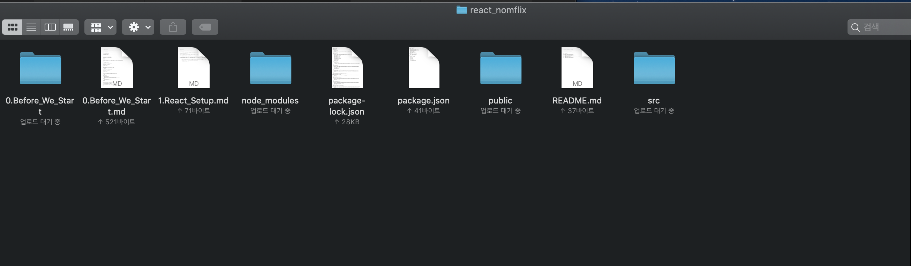

# 1. React Setup

이 페이지에서는 강의 수강을 위해 필요한 것들을 설치하는 과정을 설명한다.

## 1.1 node.js, npm

[node.js 설치 링크](https://nodejs.org/ko/)

node.js는 JavaScript 언어를 활용하여 웹 서버를 개발할 수 있도록 고안된 런타임이다. 자세한 내용은 [node.js 위키피디아](https://ko.wikipedia.org/wiki/Node.js) 를 참조

node.js를 사용하는 방법을 배우는 과정이 아니고, npm과 react를 설치 및 활용하기 위하여 설치하는 것이다.

npm은 node.js 설치 시 같이 설치되는 패키지 매니저이다.

## 1.2 npx

npm에서 설치할 수 있는 패키지들 중 일부는 일회용 패키지로, 한 번 설치하고 다시 사용하지 않는 것들이 있다. npm에서는 이러한 패키지들을 위해 npx라는 것을 제공하는데, 이는 npm에 올라와 있는 패키지를 1회 실행한 후, 자동으로 삭제 해주는 도구이다. npm 5.2.0 버전 이상이 설치된 환경이라면 자동으로 함께 설치되어 있다.

## 1.3 create-react-app

빠른 React 기반 SPA(Single Paged Application)을 제작하기 위해 Facebook에서 제공하는 도구로, 명령어 한 줄로 react 관련 패 키지를 설치해주고, 폴더 별 정리, gitignore 파일과 package.json 파일 등을 생성해준다.

`npx create-react-app (앱 이름)`

작업이 끝나면 폴더에 아래와 같은 파일 및 폴더가 생성된다.



## 1.4 .env 작성

.env는 프로젝트에 관련된 환경설정을 적는 파일로, 프로젝트의 루트 디렉토리에 생성 후, 아래와 같이 작성한다.

`NODE_PATH=src`

하는 역할은 앞으로 프로젝트 내에서 찾을 Components 들을 src 폴더 내에서 찾을 수 있게 해주는 것이다.

## 1.5 폴더 정리

프로젝트 진행에 있어 불필요한 이미지 및 파일들을 삭제한다.

1. public 폴더

   - [ ] favicon.ico, index.html, manifest.json 3개의 파일을 남기고 모두 지운다.

   - [ ] manifest.json 파일을 아래와 같이 수정한다.

     ```json
     {
       "short_name": "React App",
       "name": "Create React App Sample",
       "icons": [
         {
           "src": "favicon.ico",
           "sizes": "64x64 32x32 24x24 16x16",
           "type": "image/x-icon"
         }
       ],
       "start_url": ".",
       "display": "standalone",
       "theme_color": "#000000",
       "background_color": "#ffffff"
     }
     ```

   - [ ] index.html의 `<title></title>` 내의 내용을 원하는 제목으로 수정한다.

2. src 폴더

   - [ ] index.js와 App.js 2개의 파일을 남기고 모두 지운다.

   - [ ] index.js 파일을 아래와 같이 수정한다.

     ``` jsx
     import React from 'react';
     import ReactDOM from 'react-dom';
     import App from './App';
     
     ReactDOM.render(<App />, document.getElementById('root'));
     ```

   - [ ] App.js 파일을 아래와 같이 수정한다.

     ```jsx
     import React from 'react';
     
     class App extends React.Component {
       render() {
         return <h1>App</h1>;
       }
     }
     
     export default App;
     
     ```

     

   